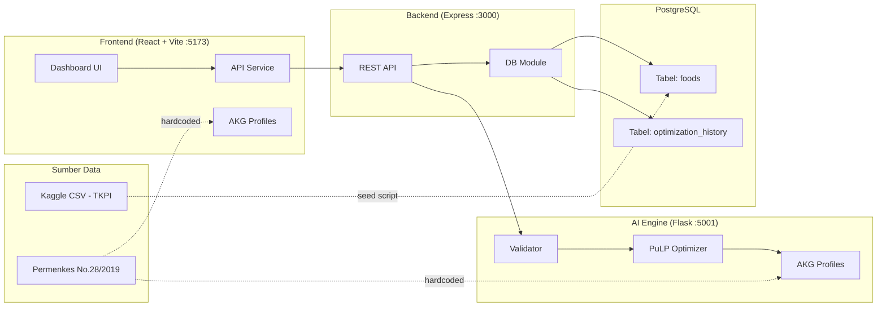
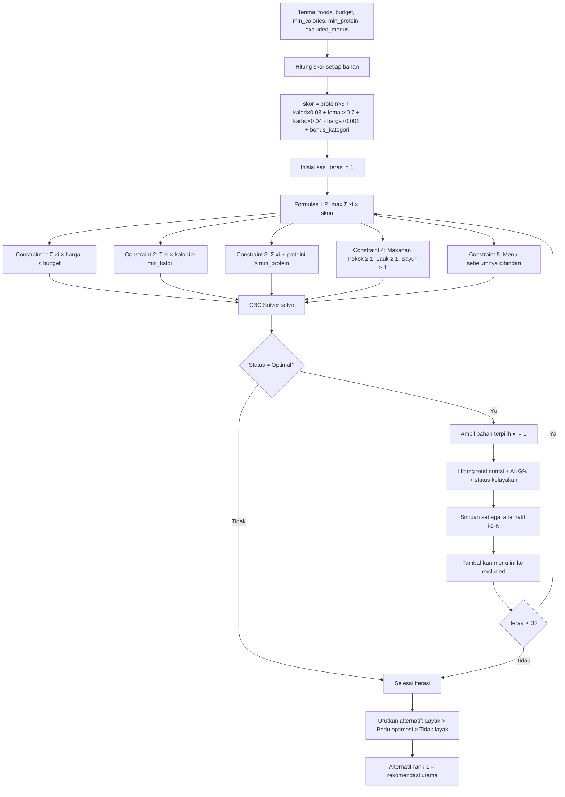
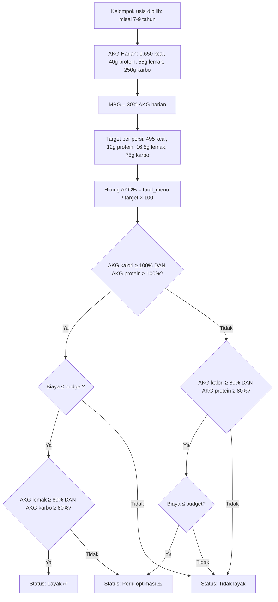
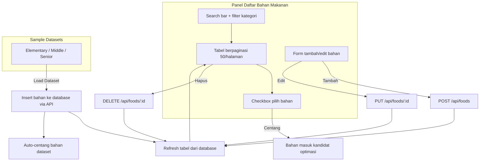
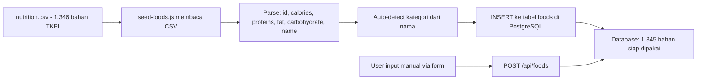

# NutriSafety AI — Flowchart Sistem (Mermaid)

## 1. Arsitektur Sistem

---

## 2. Alur Utama End-to-End

```mermaid
flowchart TD
    START(["User buka dashboard"]) --> LOAD_DB["Frontend fetch GET /api/foods"]
    LOAD_DB --> DB_QUERY["Backend query PostgreSQL"]
    DB_QUERY --> SHOW_TABLE["Tampilkan 1.345 bahan dalam tabel berpaginasi"]

    SHOW_TABLE --> SEARCH{"User cari / filter?"}
    SEARCH -->|Ya| FILTER["Filter by nama / kategori"]
    FILTER --> SELECT
    SEARCH -->|Tidak| SELECT["User centang bahan ✓"]

    SELECT --> SET_PARAMS["User atur parameter"]
    SET_PARAMS --> PARAM_DETAIL["Kelompok usia + Budget + Jumlah siswa"]
    PARAM_DETAIL --> AUTO_TARGET["Target AKG otomatis dihitung dari usia × 30%"]

    AUTO_TARGET --> PREVIEW["Preview real-time: total nutrisi, AKG%, status"]

    PREVIEW --> RUN{"User klik Run AI Optimization?"}
    RUN -->|Tidak| SELECT
    RUN -->|Ya| SEND["Frontend kirim payload ke POST /api/optimize"]

    SEND --> BACKEND["Backend validasi + forward ke AI Engine"]
    BACKEND --> AI["AI Engine terima & validasi payload"]
    AI --> SOLVE["PuLP solve Linear Programming"]

    SOLVE --> RESULT{"Solusi ditemukan?"}
    RESULT -->|Ya| RANK["Ranking 3 alternatif menu"]
    RESULT -->|Tidak| FALLBACK{"Ada excluded_menus?"}

    FALLBACK -->|Ya| RETRY["Coba ulang tanpa exclusion"]
    RETRY --> RESULT2{"Solusi ditemukan?"}
    RESULT2 -->|Ya| RANK
    RESULT2 -->|Tidak| INFEASIBLE["Return: Tidak layak / infeasible"]

    FALLBACK -->|Tidak| INFEASIBLE

    RANK --> SAVE["Simpan hasil ke PostgreSQL"]
    SAVE --> RETURN["Return hasil ke frontend"]
    RETURN --> DISPLAY["Tampilkan rekomendasi menu + AKG% + alternatif"]
    INFEASIBLE --> RETURN
```

---

## 3. Proses Optimasi AI (Detail)

---

## 4. Perhitungan AKG dan Klasifikasi

---

## 5. Alur CRUD Bahan Makanan

---

## 6. Alur Data Seed dari CSV

---

## Cara Pakai

Copy-paste syntax mermaid di atas ke:
- **Mermaid Live Editor**: https://mermaid.live
- **Markdown viewer** yang support mermaid (GitHub, Notion, dll)
- **draw.io**: import mermaid code
- **VS Code**: install extension "Markdown Preview Mermaid Support"
